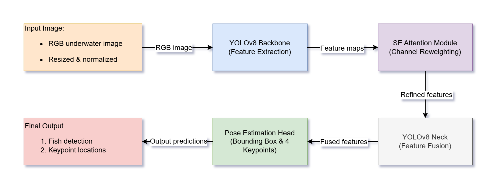

# fish-size-detection

This repository implements fish detection and pose (keypoint) estimation for aquaculture monitoring.
It is built on top of the **Ultrlytics** YOLO framework (cloned into this repo) and adds:
- Custom dataset configuration (FishKP-style: bounding box + 4 keypoints)
- Training / evaluation scripts

---

## Overview
**Goal:** Detect fish and estimate 4 keypoints to support downstream tasks such as:
- fish size estimation (length/width measurement from keypoints)
- posture / orientation analysis
- automation for aquaculture monitoring

**Base framework:** Ultralytics YOLO-Pose (e.g., YOLOv8-Pose / YOLOv11-Pose depending on your experiments)

**What’s in this repo (high level):**
- `ultralytics/`: Cloned Ultralytics repository (main framework). Inside this repo, we put the script and dataset of project.
- `installations`: Contains dockerfiles, run docker scripts.
- `assets`: Images 

--- 

## Dataset
This project use a public dataset. This dataset contains underwater images of fish captured in a controlled tank environment. Each image is annotated with bounding boxes and keypoints following the YOLO-Pose format.

The dataset is designed for:
- Fish detection
- Fish pose/keypoint estimation
- Fish size estimation based on geometric measurements

Images include multiple fish per frame, reflecting realistic aquaculture monitoring conditions.

This is the link to get the dataset: https://drive.google.com/drive/folders/14G5qUpQH5qdSwMXRlEMci_c-Zf4z_bZS?usp=drive_link

After downloading the dataset, extract and reorganize the folder structure following this structure.

```text
datasets/
├── images/
│   ├── train/
│   ├── val/
│   └── test/
├── labels/
│   ├── train/
│   ├── val/
│   └── test/
└── data.yaml
```
Finally, put the dataset into ultralytics directory. Therefore, the structure of the project directory is as follow:
```text
fish-size-detection/
├── installation/
├── ultralytics/
│   ├── datasets
```

---

## Model Architecture
<p align="center">
  
</p>

## Installation
**Build a docker images for run inference on CPU**
```bash
cd installations
docker build -f Dockerfile.cpu -t yolov8-cpu .
```

**Build a docker images for training on GPU**
```bash
cd installations
docker build -f Dockerfile.gpu -t yolov8-gpu .
```

**Run CPU container**
```bash
chmod +x run_docker_cpu.sh
./run_docker_cpu.sh
```

**Run GPU container**
```bash
chmod +x run_docker_gpu.sh
./run_docker_cpu.sh
```

---

## Training
Should run training on GPU.
```bash
python my_script_train.py
```

---

## Inference
Running inference on CPU.
```bash
python my_script_predict.py
```
---

## Results
**Learning curves of proposed model**
<p align="center">
  
</p>

**Normalized confusion matrix of proposed model**
<p align="center">
  
</p>

**Table of metric results of bounding box**
| Model | precesion(B) | recall(B) | mAP50(B) | mAP50-95(B) |
|---------------------:|-------------:|----------:|---------:|------------:|
| Baseline YOLOv8-Pose | 0.77822 | 0.85863 | 0.88494 | 0.70527 |
| Proposed YOLOv8-Pose | 0.78933 | 0.87924 | 0.90225 | 0.71564 |

**Table of metric results of keypoints detection**
| Model | precesion(B) | recall(B) | mAP50(B) | mAP50-95(B) |
|---------------------:|-------------:|----------:|---------:|------------:|
| Baseline YOLOv8-Pose | 0.78216 | 0.85201 | 0.88436 | 0.87753 |
| Proposed YOLOv8-Pose | 0.79217 | 0.88241 | 0.90339 | 0.89883 |